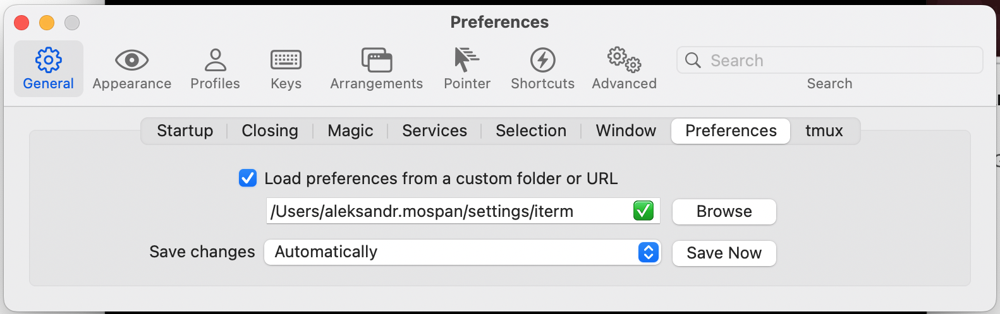

## Install applications

brew install --cask alt-tab
brew install --cask dash
brew install --cask michaelvillar-timer
brew install --cask numi
brew install --cask obsidian
brew install --cask sublime-merge
brew install --cask sublime-text
brew install --cask telegram
brew install --cask unnaturalscrollwheels
brew install --cask vlc
brew install --cask freedom
brew install --cask webstorm

## Create symlinks for

### Sublime Text
```
rm -rf ~/Library/Application\ Support/Sublime\ Text
ln -s ~/settings/sublime_text ~/Library/Application\ Support/Sublime\ Text
```

### zsh
```
rm ~/.zshrc
ln -s ~/settings/.zshrc ~/.zshrc
```

### iTerm2



### Karabiner Elements

rm -rf ~/.config/karabiner
ln -s ~/settings/karabiner ~/.config/karabiner